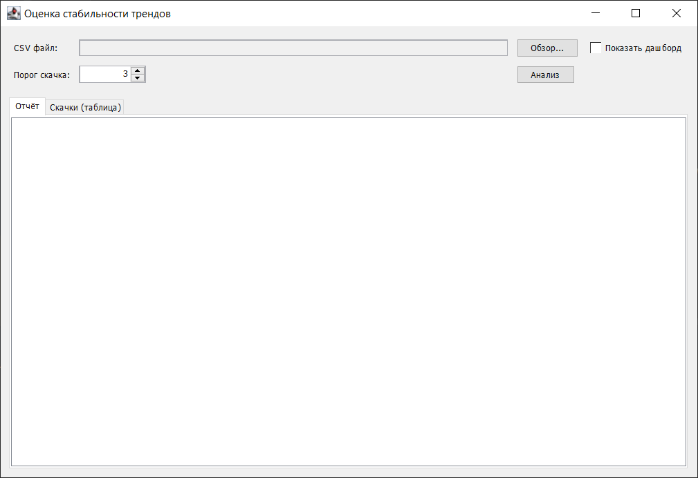
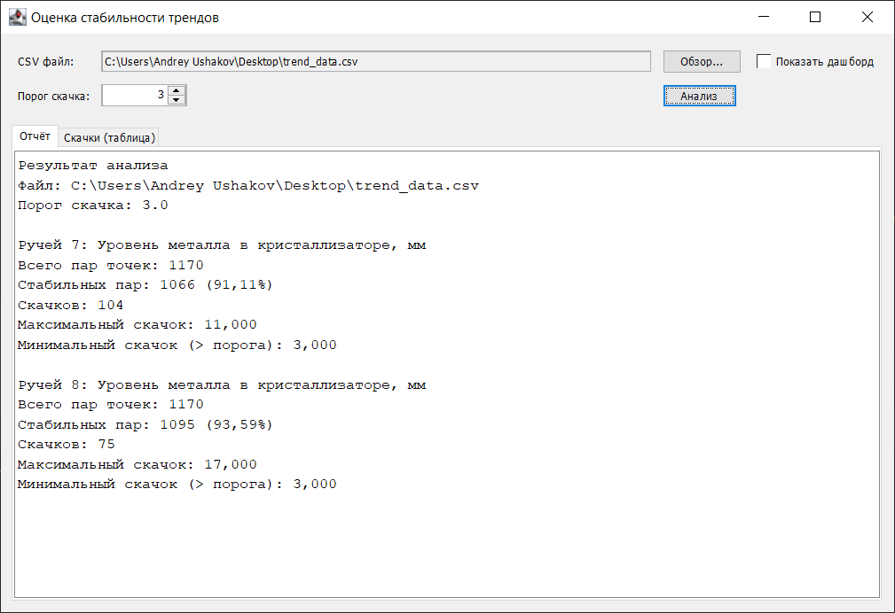
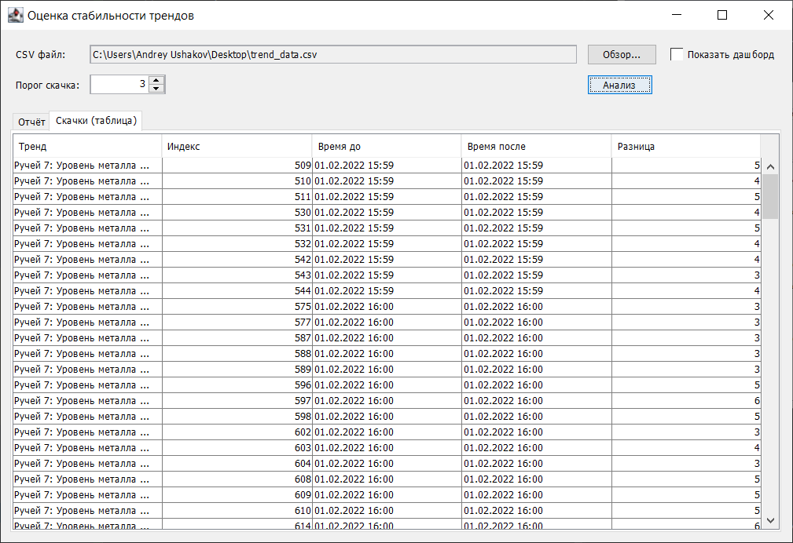
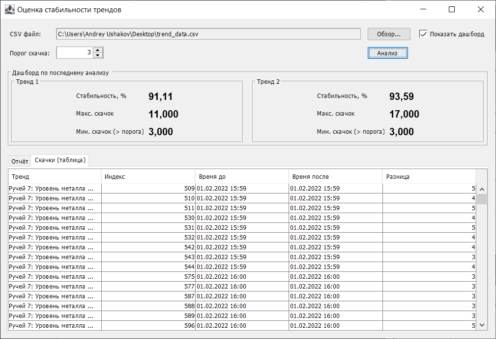

# StabilityTrends

Небольшое десктоп-приложение (Java + Swing) для оценки стабильности двух трендов из CSV.

## Возможности

- Загрузка CSV файла с двумя трендами
- Задание порога скачка
- Подсчёт:
    - стабильных и нестабильных пар точек
    - максимального скачка
    - минимального скачка ≥ порога
- Отображение результатов в отчёте
- Таблица скачков
- Дашборд с ключевыми показателями по каждому тренду

## Структура проекта

- App - главный исполняемый 
- CsvLoader — загрузка и парсинг CSV-файла
- TrendAnalyzer — анализ трендов
- StabilityResult, Jump — модели данных
- TrendAppFrame — Swing GUI (интерфейс)
- JumpRow, JumpTableModel — таблица скачков

## Скриншоты работы программы

### Первый запуск:


### Анализ CSV, вывод отчета:


### Таблица скачков:


### Дашборд:


## Требования к запуску

Убедитесь, что у вас установлены:
- Java 17 или новее
- Apache Maven 3.x

## Запуск

1. Сборка проекта:
   ```bash
   mvn clean package
2. Запуск программы:
   ```bash
   java -jar target/StabilityTrends-1.0-SNAPSHOT.jar